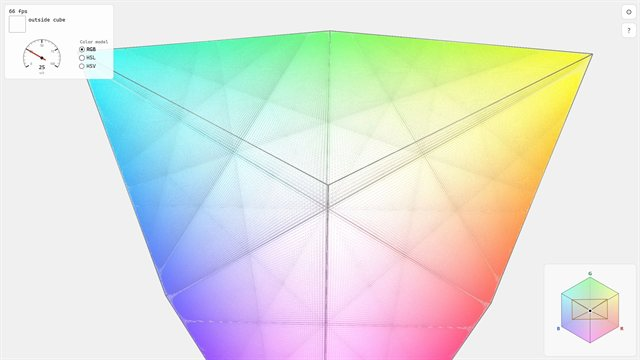
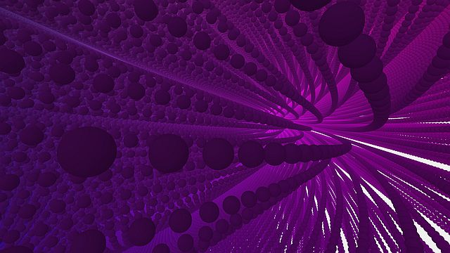
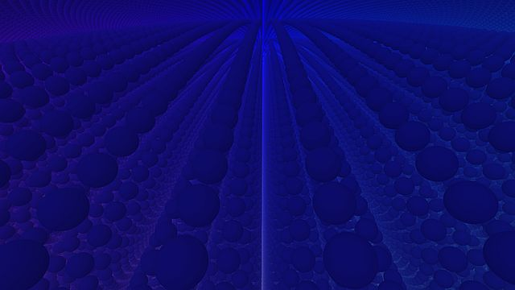

# 16,777,216 colors — Color Space Flythrough

An interactive WebGL2 flythrough of the complete RGB color space, rendered as a
256 × 256 × 256 lattice of colored spheres — one sphere for every one of the
16,777,216 (256³) colors a true-color display can show. 

## Screenshots

Click any image for the full-resolution view.

## Color models

Use the **RGB / HSL / HSV** radio buttons beside the speedometer in the top-left
box. RGB is the default cube. HSL and HSV use a cylinder: hue runs around the
vertical axis (red at +X, yellow toward +Z), saturation increases from the gray
axis to the rim, and lightness/value increases upward. HSL has a white top and
black bottom; HSV has a colored top and black bottom.

The cylinder samples colors on a uniformly spaced Cartesian lattice clipped to
a circular cross-section; it does not contain one sphere per unique RGB color.
The outline and minimap follow the selected shape, and the HUD reports the
model's own values at the camera position (`hsl(...)`/`hsv(...)` instead of
`rgb(...)` for the cylinders; hex always stays RGB) or ?outside cylinder?.
Links preserve the selection with `model=hsl` or `model=hsv` in the URL hash.
Switching models keeps your camera pose, spacing, and quality settings.

## Requirements

- Node.js ≥ 20.19 (or ≥ 22.12) for Vite 7 and `node --test`
- A WebGL2-capable browser (current Chrome, Edge, Firefox, or Safari)

### Controls

| Input | Action |
| --- | --- |
| `W` / `S` | Move forward / backward |
| `A` / `D` | Move along the camera's horizontal screen axis |
| `Space` / `Ctrl` or `C` | Move along the camera's vertical screen axis |
| `Shift` | ×4 speed boost |
| Mouse wheel | Increase / decrease maximum move speed |
| Left-drag | Look around |
| `1`–`5` | Manual LOD stride (1, 2, 4, 8, 16) |
| `0` | Return to automatic LOD |
| `Tab` | Toggle settings panel |
| `H` | Toggle HUD — hides the minimap, info box, hint, and the gear/help buttons |
| `F` | Toggle fullscreen (locks WASD/Space/Ctrl keys where supported) |
| `Esc` | Close settings panel |
| `?` button | Toggle hint box |

> Tip: in windowed mode `Ctrl+W` closes the tab; fullscreen mode (via `F`) also
> prevents that, which is why the hint box mentions it.

### URL parameters

All state lives in the URL hash (`#key=value&…`) and round-trips through the
settings panel — the panel updates the hash, and a hash updates the panel.

| Parameter | Example | Meaning |
| --- | --- | --- |
| `cam` | `cam=160,160,160` | Camera position (lattice space); the camera then faces the origin |
| `yaw`, `pitch` | `yaw=-38.8&pitch=-32.8` | View orientation in degrees |
| `fov` | `fov=90` | Field of view in degrees (40–100) |
| `sp` | `sp=1.5` | Sphere spacing (0.5–2) |
| `r` | `r=0.4` | Sphere radius (0.02 – (spacing−0.02)/2) |
| `far` | `far=800` | View / fog distance (100–1500) |
| `speed` | `speed=20` | Base move speed |
| `sens` | `sens=1.5` | Mouse sensitivity multiplier (0.1–3) |
| `scale` | `scale=0.75` | Render scale (0.5, 0.75, 1) |
| `fps` | `fps=120` | Automatic-LOD target FPS (60–144) |
| `minscale` | `minscale=0.33` | Minimum automatic resolution scale |
| `bg` | `bg=%23002244` | Background color, `#rrggbb` |
| `fog`, `shade`, `axes` | `fog=0` | Toggle depth-cue fog, shading, cube outline (`1`/`0`) |
| `debug` | `debug=1` | Debug view: R = distance, G/B = |normal.x|/|normal.y| |
| `k` | `k=4` | Fixed LOD stride (power of two, 1–16) |
| `auto` | `auto=1` | Force automatic LOD on |
| `quads` | `quads=0` | Disable near-field quad pass entirely |
| `panel` | `panel=1` | Open the settings panel on load |

## License

MIT — see [LICENSE](LICENSE).
